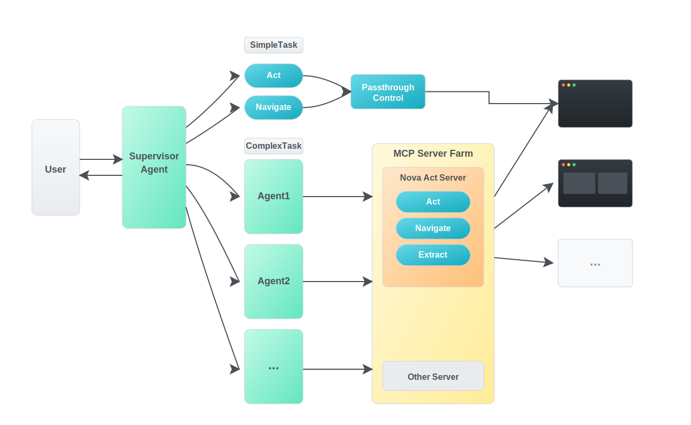
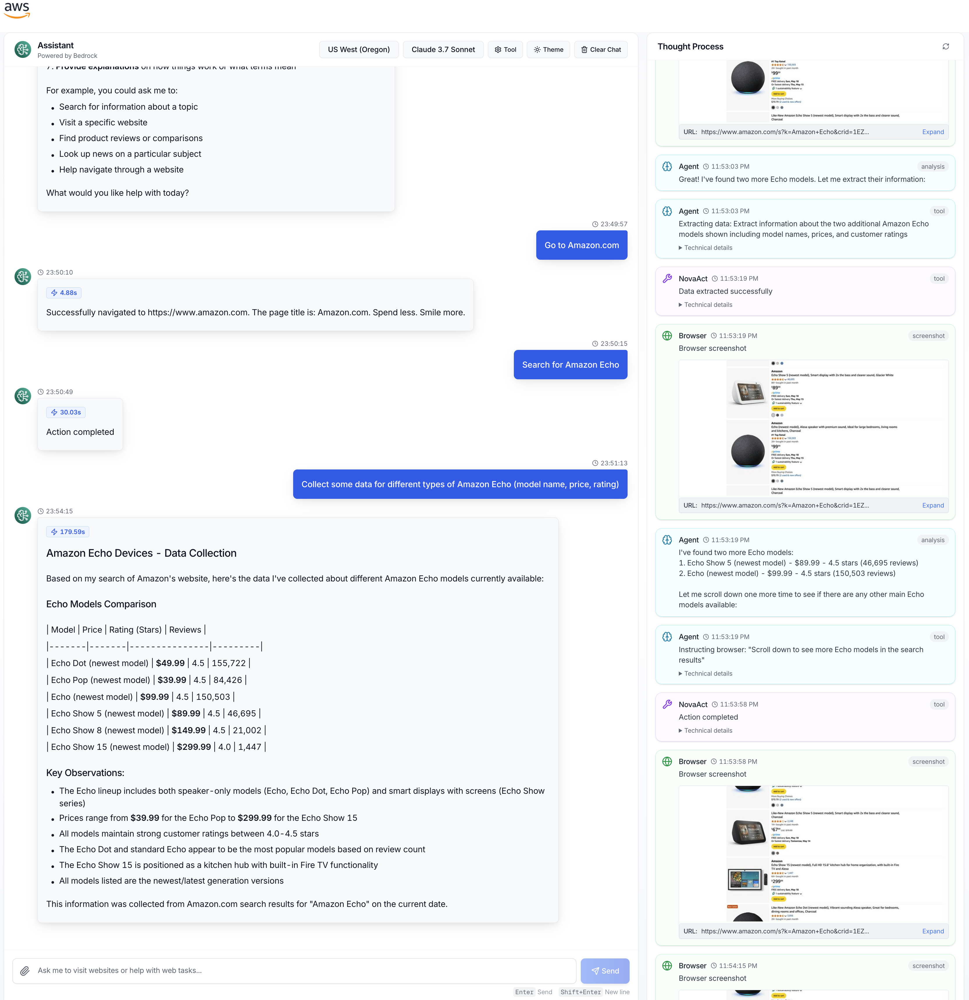

# Nova Act Browser Automation Chatbot

A sophisticated browser automation platform integrating Model Context Protocol (MCP) with multi-tier AI orchestration.

## Key Features

### 1. Amazon Bedrock Integration
- Seamless integration with Amazon Bedrock's foundation models and capabilities
- Compatible with a wide range of Bedrock-provided AI models including Claude and others
- Leverages Bedrock's security, scalability, and enterprise-grade features
- Enables access to continuously updated models without requiring system changes

### 2. 3-Layer Orchestration Architecture
The system employs a three-tier AI architecture for handling complex browser automation tasks:

- **Supervisor Layer**: Breaks down complex tasks into manageable missions, provides context awareness, and coordinates the overall workflow
- **Agent Layer**: Executes specific browser missions, interprets results, and makes tactical decisions
- **Nova Act Layer**: Performs direct browser interactions based on natural language instructions

### 3. MCP Integration with Nova Act
- Seamless integration with Model Context Protocol (MCP) allowing easy connection of various tools
- Standardized communication between AI models and browser automation
- Extensible tool interface for adding custom capabilities

### 4. Automated Workflow Routing
- Intelligent request classification to determine appropriate execution strategy
- Smart routing between navigation, action, and complex agent workflows
- Dynamic adaptation to different task complexities based on user intent

### 5. Workflow Customization
- Nova Act handles actions while orchestration is managed by agents and supervisors
- Easily optimizable for specific workflows through prompt modifications
- Adaptable to different use cases without code changes


> **Note on Multi-Browser Support**: Previous versions supported parallel processing with multiple browser instances. This feature is currently disabled due to usage limitations in the Nova Act SDK Preview. However, the system architecture is designed for future scalability with asynchronous implementation, allowing the Supervisor Agent to orchestrate multiple Browser Control Agents with individual browser instances simultaneously when SDK constraints are lifted.


## Architecture



### Supervisor Agent
The Supervisor Agent acts as the orchestration layer, serving as the bridge between user intent and execution strategy:

- **Task Analysis**: Interprets user requests to understand the true intent and required outcomes
- **Task Decomposition**: Breaks complex requests into a sequence of simpler, executable steps
- **Execution Strategy Selection**: Determines whether to route tasks as simple navigation, direct actions, or complex workflows
- **Context Management**: Maintains awareness of the conversation history and task progression
- **Progress Monitoring**: Tracks the completion status of sub-tasks and determines when the overall goal is achieved
- **Response Synthesis**: Compiles findings and results into coherent, informative responses for the user

For simple tasks, the Supervisor will route directly to the appropriate tool (Act for interactions, Navigate for URL changes). For complex tasks requiring multiple steps and reasoning, it engages the Browser Control Agent.

### Browser Control Agent
The Browser Control Agent manages complex browser interactions and task execution:

- **Mission Execution**: Takes specific missions from the Supervisor and translates them into concrete browser actions
- **Visual Analysis**: Interprets screenshots and page content to understand the browser state
- **Dynamic Decision Making**: Makes tactical decisions about how to accomplish the given mission
- **Data Extraction**: Identifies and extracts relevant information from web pages
- **Error Handling**: Manages obstacles like pop-ups, login walls, or navigation issues
- **Adaptive Navigation**: Adjusts its approach based on the evolving state of the browser
- **Reporting**: Provides structured feedback about actions taken, information found, and any obstacles encountered

The Browser Control Agent interacts with the Nova Act Server through MCP tools (Act, Navigate, Extract) to perform the actual browser manipulations and data gathering.

## Task Processing Flow

When users submit natural language requests, the system:

1. **Classification**: Router analyzes the request to determine the optimal execution path
2. **Task Planning**: Supervisor breaks complex tasks into sequential steps
3. **Execution**: Agent interprets each step and coordinates with Nova Act for browser interactions
4. **Analysis**: Results are processed and presented to the user with visual feedback

The system intelligently switches between simple navigation, direct browser actions, and complex multi-step workflows based on the request complexity, with no manual mode selection required.

markdown

## Visual Examples

### Shopping



## Installation

### Prerequisites
- MacOS
- Python 3.10+
- Node.js 18+
- npm or yarn

### Backend Setup

```bash
# Clone the repository
git clone https://github.com/aws-samples/browser-control-with-nova-act.git
cd browser-control-with-nova-act

# Create and activate virtual environment
python -m venv venv
source venv/bin/activate  # On Windows: venv\Scripts\activate

# Install backend dependencies
cd py-backend
pip install -r requirements.txt
```

### Frontend Setup

```bash
# From the project root
cd ..
npm install   # or yarn install
```

## Configuration

### Set Nova Act API Key

```bash
# Set environment variable
export NOVA_ACT_API_KEY="your_api_key_here"

# Alternatively, add to .env file
echo "NOVA_ACT_API_KEY=your_api_key_here" >> .env
```

### Configure Browser Settings

Edit `py-backend/app/libs/config.py` to customize browser behavior:

```python
# Core browser settings
BROWSER_HEADLESS = False  # Set to True for headless operation
BROWSER_START_URL = "https://www.google.com"  # Default starting URL
BROWSER_MAX_STEPS = 3  # Maximum steps for Nova Act

# Browser profile settings (for authentication)
BROWSER_USER_DATA_DIR = '/path/to/chrome/profile'  # For persistent sessions
BROWSER_CLONE_USER_DATA = True  # Clone profile to protect original

# Performance settings
BROWSER_TIMEOUT = 100  # Timeout in seconds
BROWSER_URL_TIMEOUT = 60  # URL navigation timeout
```

The system allows using session information through the `BROWSER_USER_DATA_DIR` setting and can clone the user profile with `BROWSER_CLONE_USER_DATA`, enabling persistent logins and site preferences while protecting the original profile from modifications.

### Configure AI Models

```python
# In py-backend/app/libs/config.py

# Default model configurations
DEFAULT_MODEL_ID = "us.anthropic.claude-3-7-sonnet-20250219-v1:0"  # Change as needed
MAX_SUPERVISOR_TURNS = 4  # Maximum conversation turns between supervisor and agent
MAX_AGENT_TURNS = 6  # Maximum turns between agent and MCP tools
```

Only models with Tool Use and multimodal capabilities are compatible with Browser Control With Nova Act. Claude Sonnet 3.7 and Sonnet 3.5 work best for optimal performance. While Nova models can work, they occasionally encounter errors with tool use formatting.

## Running the Application

### Start the Application

```bash
# From project root
npm run dev
```

Running `npm run dev` starts both the frontend application and the backend Nova MCP server simultaneously, providing a streamlined development experience.

The application will be available at http://localhost:3000

## Usage

### Intelligent Task Routing

The system automatically determines the most appropriate execution strategy for each user request:

- **Navigation Requests**: Simple website visits and URL navigation
- **Action Requests**: Direct interactions with visible elements on current pages
- **Complex Information Tasks**: Multi-step research, information gathering, and comparison workflows

### Example Commands

```
# Navigation examples
"Go to amazon.com"
"Search for wireless headphones on Best Buy"

# Action examples
"Click the search bar and type 'wireless headphones'"
"Scroll down to see more products"
"Add the first item to my cart"

# Complex research examples
"Find the best-rated wireless headphones under $100 and compare their features"
"Research the average house prices in Seattle over the last 5 years"
"Give me a summary of the latest news about artificial intelligence"
```

## Advanced Configuration

### Customizing Prompts

You can modify the system's behavior by adjusting the prompt templates:

- `ROUTER_PROMPT`: Controls task classification logic
- `SUPERVISOR_PROMPT`: Guides high-level mission planning
- `NOVA_ACT_AGENT_PROMPT`: Defines browser interaction behavior

### Performance Tuning

For optimal performance, adjust these settings based on your use case:

```python
# In py-backend/app/libs/config.py

# Browser performance settings
BROWSER_SCREENSHOT_QUALITY = 70  # Lower for faster performance
BROWSER_SCREENSHOT_MAX_WIDTH = 800  # Balance between detail and size
BROWSER_RECORD_VIDEO = False  # Enable for debugging

# Conversation memory settings
MAX_CONVERSATION_MESSAGES = 50  # Reduce for lower memory usage
```

### Conversation Storage Options

The system supports different storage mechanisms for conversation history:

```python
# In-memory storage (faster, not persistent)
CONVERSATION_STORAGE_TYPE = "memory"

# File-based storage (persistent across restarts)
CONVERSATION_STORAGE_TYPE = "file"
CONVERSATION_FILE_TTL_DAYS = 7  # Auto-cleanup after 7 days
```

## Technical Details

### Session Management

The backend maintains browser sessions per user, allowing for continuous interactions across multiple requests. Sessions include:

- Browser state and navigation history
- Conversation context
- Screenshots and visual feedback

### Error Handling

Comprehensive error management includes:

- Automatic recovery from common browser issues
- Clear error messages with visual context
- Session persistence during temporary failures

### Thought Process Visualization

The system provides transparency into its decision-making process through:

- Step-by-step reasoning logs
- Visual feedback of browser state
- Execution pathways and decision points

## License

This project is licensed under the MIT License - see the LICENSE file for details.