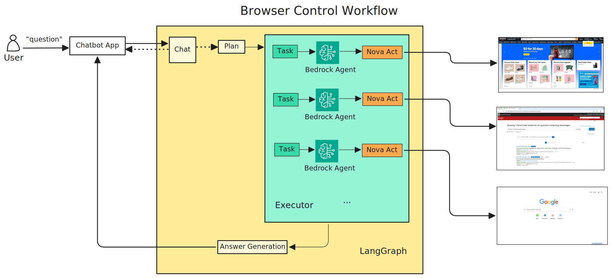

# Nova Act Browser Automation Chatbot

## Application Overview

Nova Act Browser Automation Chatbot provides an interactive interface for controlling web browsers using natural language commands. It leverages the Nova Act SDK to transform user requests into direct browser actions and integrates with Amazon Bedrock's LLMs to provide intelligent analysis of browser activities.

The application supports two operational modes:

1. **Direct Mode**: Passes user's natural language commands directly to the Nova Act SDK
2. **Agent Mode**: Utilizes multiple AI agents to handle complex browser tasks

## System Requirements (Tested on)

- **Operating System**: Tested on macOS (Apple Silicon)
- **Python Version**: 3.12
- **Dependencies**: See `requirements.txt` for full list

> **Note**: This application has been primarily tested on macOS with Python 3.12. While it may work on other operating systems, some adjustments might be necessary.

## Demo 1 - Shopping (Live)


## Demo 2 - Travel Planning (Playback)


## Usage Instructions

### 1. Set Up Nova Act API Key

An API key is required to use Nova Act:

1. Navigate to [https://nova.amazon.com/act](https://nova.amazon.com/act) and generate an API key.
2. Save it as an environment variable by executing in the terminal:

```bash
export NOVA_ACT_API_KEY="your_api_key"
```

### 2. Set Up Virtual Environment

```bash
# Create virtual environment
python3 -m venv .venv

# Activate virtual environment
source .venv/bin/activate

# Install dependencies
pip install -r requirements.txt
```

### 3. Nova Act - Direct Mode

Direct mode passes natural language commands directly to the Nova Act SDK:

```bash
chainlit run -w nova_act_direct.py
```

#### Configuration

Nova Act operation parameters can be configured in the `core/config.py` file:

- `headless`: Whether to run the browser in background mode
- `max_steps`: Maximum number of steps Nova Act will perform
- `timeout`: Maximum execution time (in seconds) for each action


#### Example Commands:

- "go to amazon.com and search for white shirt"
- "scroll down the page"
- "click on the third result"


### 4. Nova Act - Agent Mode

Agent mode utilizes a multi-agent architecture to handle complex browser tasks:

```bash
chainlit run -w nova_act_agent.py
```

The Agent Mode implements a three-tier hierarchical structure for browser automation:



1. **High Level - LangGraph**
   - Handles user engagement and conversation flow management
   - Performs task decomposition using Plan-Execute Pattern
   - Makes high-level decisions and task planning

2. **Mid Level - Bedrock Agent**
   - Breaks down complex tasks into smaller, manageable actions
   - Monitors execution progress and adjusts actions dynamically

3. **Low Level - Nova Act**
   - Executes specific browser-based tasks
   - Performs concrete actions like navigation and data input
   - Reports execution status back to higher levels

#### Agent Mode Configuration

```python
# core/config.py
DEFAULT_BROWSER_SETTINGS = {
    "start_url": "https://www.google.com",
    "headless": True,
    "record_video": False,
    "screenshot_dir_prefix": "nova_act_screenshots_",
    "parallel_mode": True,  
    "max_concurrent_browsers": 2,  
    "timeout": 200,  
    "max_steps": 10  
}

EXECUTION_CONFIG = {
    "max_turns": 10,
    "collect_results": False
}
```
In Agent mode, you can configure the following:

- All Nova Act configuration parameters from Direct mode
- Maximum iteration count for Bedrock Agent
- AI model settings for each stage
- Browser controller behavior
- Task partitioning and planning strategies

## License

This library is licensed under the MIT-0 License. See the LICENSE file.
