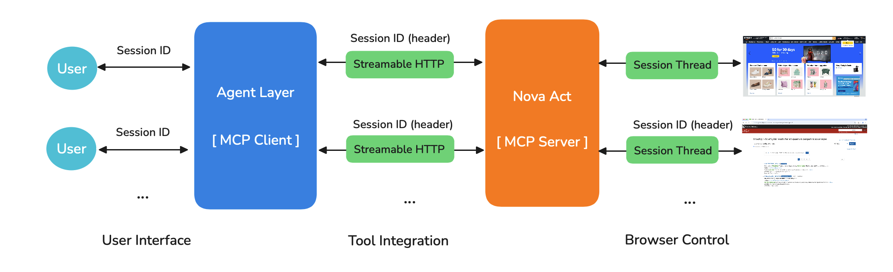

# Browser Automation with Amazon Nova Act

Automate web tasks using natural language with Amazon Nova Act and Bedrock. Transform routine browser interactions into simple conversational commands that free up your time for more meaningful work.

## What is Nova Act?

Nova Act is Amazon's specialized AI model designed specifically for reliable web browser automation. Unlike general-purpose language models, Nova Act excels at translating natural language instructions into precise browser actions—clicking, typing, scrolling, and navigating just like a human would.

## Key Features

### 🎯 **Natural Language Browser Control**
Control any website using simple, conversational commands:
```
"Search for wireless headphones on Amazon"
"Find the best-rated product under $100"
"Add it to my cart and proceed to checkout"
```

### 🧠 **Intelligent Agent Layer** 
Bridges the gap between human intent and browser actions:
- **Purpose-Driven Navigation**: Knows which websites to visit and what elements matter
- **Contextual Continuity**: Maintains context across complex multi-step tasks
- **Smart Task Breakdown**: Converts high-level goals into step-by-step browser actions

### 🚀 Multi-Session Browsing


Enable multiple sessions (or users) to automate browser tasks simultaneously:
- **Session-Based Isolation**: Each user gets a dedicated browser instance with unique session ID
- **Independent Browser Profiles**: Separate cookies, authentication, and browsing data per session
- **Parallel Task Execution**: Multiple browser automation tasks run concurrently without interference
- **Scalable Architecture**: Handles dozens of concurrent users with isolated browser contexts

#### Session-Level Cleanup & Recovery
The system includes intelligent session-specific cleanup for robust multi-user operation:

**🔧 Reactive Cleanup System**
- **Surgical Recovery**: When a session encounters browser issues, only that specific session is cleaned up
- **Session Isolation**: Other users' browser sessions remain completely unaffected
- **Automatic Retry**: Failed sessions get cleaned up automatically and prompt user to retry

**📁 Profile Management**
```
~/.nova_browser_profiles/base/          # Base template (shared)
/tmp/nova_browser_sessions/
├── session_abc123-session-id/          # Session A's profile
├── session_def456-session-id/          # Session B's profile  
└── session_ghi789-session-id/          # Session C's profile
```

**🛠️ What Gets Cleaned Up (Per Session)**
- Browser processes using that session's profile directory
- Profile lock files preventing new browser instances
- Temporary session profile directories
- Session-specific browser state and cache

**✅ Production-Ready Multi-User Support**
- Multiple users can take/release browser control simultaneously
- Browser conflicts in one session don't affect others
- Automatic cleanup prevents resource leaks and profile conflicts
- No manual intervention required for session recovery

### 👥 **Human-in-the-Loop**
Seamlessly handles scenarios that require human judgment:
- Authentication challenges and CAPTCHAs
- Ambiguous UI elements
- Unexpected interface changes
- Intelligent handoff between automated and manual control

### 🔌 **Model Context Protocol (MCP) Integration**


Advanced tool integration through standardized protocol:
- Standardized Tool Communication enables seamless integration of browser automation with external services
- Streamable HTTP Transport enables real-time bidirectional communication between agents and tools with optimizerd resource usage

## Demo

### Real-World Use Cases
This system enables automation across various domains:
- **Fashion Research**: Trend analysis and product comparison
- **Financial Analysis**: Market research and data gathering  
- **E-commerce**: Shopping, price comparison, and inventory management
- **News Aggregation**: Technology trends and industry insights
- **Travel Planning**: Flight searches, hotel bookings, and itinerary planning

### E-commerce Shopping (from Search to Cart)
- `Go to Amazon and search for 'laptop stand'. Filter by brand 'AmazonBasics', check customer ratings above 4 stars, and add the adjustable one to your cart.`


### Financial Product (ETF) Comparison 
- `Go to https://investor.vanguard.com/investment-products/index-fudds`
- `Filter for Stock-Sector funds only, then identify which sector ETF has the best YTD performance. Also note its expense ratio and 5-year return.`


### Fashion Trend Analysis
- `Analyze current fashion trends on Pinterest for “summer 2025 fashion women".`


## Quick Start

### Prerequisites
- **Operating System**: MacOS (recommended)
- **Python**: 3.10 or higher
- **Node.js**: 18 or higher
- **Package Manager**: npm or yarn

### Installation

```bash
# Clone the repository
git clone https://github.com/aws-samples/browser-control-with-nova-act.git
cd browser-control-with-nova-act

# Backend setup
python -m venv venv
source venv/bin/activate  # On Windows: venv\Scripts\activate
cd py-backend
pip install -r requirements.txt

# Frontend setup
cd ..
npm install
```

### Configuration

**1. Set up Environment Variables**
```bash
# Copy the example environment file
cd py-backend
cp .env.example .env

# Edit .env file and add your Nova Act API Key and AWS credentials
# NOVA_ACT_API_KEY=your_api_key_here
# AWS_PROFILE=your_aws_profile_name
# AWS_REGION=us-east-1
```

**Required Environment Variables:**
- `NOVA_ACT_API_KEY`: Your Nova Act API key from nova.amazon.com/act
- `AWS_PROFILE`: Your AWS SSO profile name (e.g., `username+account-Admin`)
- `AWS_REGION`: AWS region for Bedrock API calls (e.g., `us-east-1`)

**Alternative: Use system environment variables**
```bash
export NOVA_ACT_API_KEY="your_api_key_here"
export AWS_PROFILE="your_aws_profile_name"
export AWS_REGION="us-east-1"
```

**AWS Credentials Setup:**
This project requires AWS credentials for Bedrock API access. Ensure you have:
1. AWS CLI configured with SSO: `aws configure sso`
2. Valid AWS session: `aws sso login --profile your-profile-name`
3. Bedrock access permissions in your AWS account

**2. Configure Browser Settings (Optional)**
All browser settings can be configured in the `.env` file or by editing `py-backend/app/libs/config/config.py`:
```python
# Core browser settings
BROWSER_HEADLESS = True  # Set to False for debugging
BROWSER_START_URL = "https://www.google.com"
BROWSER_MAX_STEPS = 2  # Keep small for reliability

# Browser profile (for persistent sessions)
BROWSER_USER_DATA_DIR = '/path/to/chrome/profile'
```

**3. AI Model Configuration**
```python
# Multimodal models required for screenshot interpretation
DEFAULT_MODEL_ID = "us.amazon.nova-premier-v1:0"
# Tested models: Nova Premier, Claude 3.7 Sonnet, Claude 3.5 Sonnet
```

### Running the Application

**Recommended Method (handles all setup automatically):**
```bash
npm run dev
```

This command will:
- Activate the Python virtual environment
- Set up proper module paths
- Start both frontend and backend servers concurrently
- Kill any existing processes on port 8000

**Manual Method (if needed):**
```bash
# Terminal 1: Start backend
cd py-backend
source venv/bin/activate
uvicorn app.app:app --host 0.0.0.0 --port 8000

# Terminal 2: Start frontend  
npm run client-dev
```

Visit **http://localhost:3000** to start automating!

**Troubleshooting:**
- If you get "Unable to locate credentials" error, ensure AWS_PROFILE and AWS_REGION are set in your `.env` file
- If you get "No module named 'app'" error, use `npm run dev` instead of running Python directly
- If port 8000 is busy, run `npm run kill-port` first

## Usage Examples

### Basic Commands
```
# Simple navigation
"Go to amazon.com"
"Search for wireless headphones"

# Interactive actions  
"Click the search bar and type 'gaming laptop'"
"Scroll down to see more products"
"Select the third result"

# Complex research tasks
"Find gaming laptops under $1000 and compare their specs"
"Research the latest AI news and summarize key trends"
"Book a flight from Seattle to New York for next Friday"
```

## Architecture Overview


The system uses a three-tier architecture:
- **Supervisor Layer**: Breaks down complex tasks and coordinates workflow
- **Agent Layer**: Executes browser missions and interprets results  
- **Nova Act Layer**: Performs direct browser interactions

## Learn More

A detailed blog post covering technical implementation, architectural decisions, and advanced usage patterns will be published soon. It will include:
- Deep dive into the agent architecture
- Advanced prompting strategies  
- Performance optimization techniques
- Troubleshooting common issues
- Real-world deployment scenarios

## Contributing

We welcome contributions! Please see [CONTRIBUTING.md](CONTRIBUTING.md) for guidelines.

## License

This project is licensed under the MIT License - see the [LICENSE](LICENSE) file for details.

---

**Ready to automate your web workflows?** Start with `npm run dev` and experience the future of browser automation! 🚀